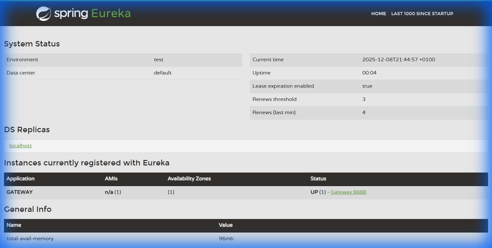

# TP 20 : Architecture Micro-services avec RestTemplate

## 📋 Description

Ce projet implémente une architecture microservices complète utilisant Spring Cloud et RestTemplate pour la communication inter-services. Il met en place un service de découverte Eureka, une passerelle API Gateway, et deux microservices métier (Client et Voiture) qui communiquent entre eux via RestTemplate.

---

## 🏗️ Architecture du Projet

```
┌─────────────────────────────────────────────────────────────────┐
│                         GATEWAY (8888)                          │
│              Spring Cloud Gateway + Eureka Client               │
└─────────────────────────────────────────────────────────────────┘
                                │
                                ▼
┌─────────────────────────────────────────────────────────────────┐
│                    EUREKA SERVER (8761)                         │
│                     Service Discovery                           │
└─────────────────────────────────────────────────────────────────┘
                    ▲                       ▲
                    │                       │
        ┌───────────┴───────────┐ ┌────────┴────────────┐
        │  SERVICE-CLIENT (8081) │ │  SERVICE-CAR (8082)  │
        │  ┌─────────────────┐  │ │  ┌─────────────────┐  │
        │  │   MySQL DB      │  │ │  │   MySQL DB      │  │
        │  │ clientservicedb │  │ │  │  carservicedb   │  │
        │  └─────────────────┘  │ │  └─────────────────┘  │
        └───────────────────────┘ └───────────────────────┘
                                          │
                                          │ RestTemplate
                                          ▼
                                  Communication avec
                                  SERVICE-CLIENT
```

---

## 📸 Screenshots

### Dashboard Eureka - Service Discovery

Le tableau de bord Eureka affiche tous les services enregistrés dans l'architecture microservices :



*Dashboard Eureka montrant les services enregistrés (GATEWAY, SERVICE-CLIENT, SERVICE-CAR)*

## 📁 Structure des Services

### 1. Eureka Server (Port 8761)

| Propriété | Valeur |
|-----------|--------|
| **Rôle** | Service Discovery |
| **Technologies** | Spring Cloud Netflix Eureka Server |
| **Port** | 8761 |
| **URL Dashboard** | http://localhost:8761 |

**Fichiers principaux :**
```
eureka-server/
├── pom.xml
└── src/main/
    ├── java/com/example/eurekaserver/
    │   └── EurekaServerApplication.java
    └── resources/
        └── application.yml
```

---

### 2. Client Service (Port 8081)

| Propriété | Valeur |
|-----------|--------|
| **Rôle** | Gestion des clients |
| **Technologies** | Spring Boot, Spring Data JPA, MySQL, Eureka Client, Lombok |
| **Port** | 8081 |
| **Base de données** | `clientservicedb` |

**Endpoints :**

| Méthode | URL | Description |
|---------|-----|-------------|
| GET | `/api/client` | Liste tous les clients |
| GET | `/api/client/{id}` | Récupère un client par ID |
| POST | `/api/client` | Crée un nouveau client |

**Fichiers principaux :**
```
client-service/
├── pom.xml
└── src/main/
    ├── java/com/example/client/
    │   ├── ClientServiceApplication.java
    │   ├── entities/
    │   │   └── Client.java
    │   ├── repositories/
    │   │   └── ClientRepository.java
    │   ├── services/
    │   │   └── ClientService.java
    │   └── controllers/
    │       └── ClientController.java
    └── resources/
        └── application.yml
```

---

### 3. Gateway (Port 8888)

| Propriété | Valeur |
|-----------|--------|
| **Rôle** | API Gateway / Point d'entrée unique |
| **Technologies** | Spring Cloud Gateway, Eureka Client |
| **Port** | 8888 |
| **Routage** | Découverte automatique des services via Eureka |

**Fichiers principaux :**
```
gateway/
├── pom.xml
└── src/main/
    ├── java/com/example/gateway/
    │   └── GatewayApplication.java
    └── resources/
        └── application.yml
```

---

### 4. Car Service (Port 8082)

| Propriété | Valeur |
|-----------|--------|
| **Rôle** | Gestion des voitures avec communication inter-services |
| **Technologies** | Spring Boot, Spring Data JPA, MySQL, Eureka Client, RestTemplate, Lombok |
| **Port** | 8082 |
| **Base de données** | `carservicedb` |

**Endpoints :**

| Méthode | URL | Description |
|---------|-----|-------------|
| GET | `/api/car` | Liste toutes les voitures avec les infos clients |
| GET | `/api/car/{id}` | Récupère une voiture par ID avec les infos client |
| POST | `/api/car` | Crée une nouvelle voiture |

**Fichiers principaux :**
```
car-service/
├── pom.xml
└── src/main/
    ├── java/com/example/car/
    │   ├── CarApplication.java (avec RestTemplate)
    │   ├── entities/
    │   │   └── Car.java
    │   ├── models/
    │   │   ├── Client.java (DTO)
    │   │   └── CarResponse.java
    │   ├── repositories/
    │   │   └── CarRepository.java
    │   ├── services/
    │   │   └── CarService.java
    │   └── controllers/
    │       └── CarController.java
    └── resources/
        └── application.yml
```

---

## 🚀 Guide de Démarrage

### Prérequis

- ☕ **Java 17+**
- 📦 **Maven 3.6+**
- 🐬 **MySQL Server** (port 3306)
- MySQL avec utilisateur `root` sans mot de passe (ou modifier la configuration)

### Ordre de Démarrage

> ⚠️ **Important :** Les services doivent être démarrés dans l'ordre suivant pour assurer le bon fonctionnement de l'architecture.

#### 1️⃣ Démarrer MySQL

```bash
# Assurez-vous que MySQL est en cours d'exécution sur le port 3306
# Les bases de données seront créées automatiquement
```

#### 2️⃣ Démarrer Eureka Server

```bash
cd eureka-server
mvn spring-boot:run
```
➡️ Accédez à http://localhost:8761 pour vérifier

#### 3️⃣ Démarrer Client Service

```bash
cd client-service
mvn spring-boot:run
```

#### 4️⃣ Démarrer Gateway

```bash
cd gateway
mvn spring-boot:run
```

#### 5️⃣ Démarrer Car Service

```bash
cd car-service
mvn spring-boot:run
```

---

## 🧪 Tests des Endpoints

### Via Gateway (Port 8888) - Recommandé

```bash
# Liste des clients
curl http://localhost:8888/SERVICE-CLIENT/api/client

# Liste des voitures
curl http://localhost:8888/SERVICE-CAR/api/car

# Un client spécifique
curl http://localhost:8888/SERVICE-CLIENT/api/client/1

# Une voiture spécifique
curl http://localhost:8888/SERVICE-CAR/api/car/1
```

### Accès Direct aux Services

```bash
# Client Service directement
curl http://localhost:8081/api/client

# Car Service directement
curl http://localhost:8082/api/car
```

### Création de données

```bash
# Créer un client
curl -X POST http://localhost:8081/api/client \
  -H "Content-Type: application/json" \
  -d '{"nom": "Amine SAFI", "age": 23}'

# Créer une voiture
curl -X POST http://localhost:8082/api/car \
  -H "Content-Type: application/json" \
  -d '{"brand": "Ford", "model": "2022", "matricule": "12 A 2345", "client_id": 1}'
```

---

## 📚 Concepts Clés

### 🔄 RestTemplate

RestTemplate est utilisé dans le **Car Service** pour récupérer les informations du client associé à chaque voiture. Cela démontre la **communication synchrone** entre microservices.

```java
// Exemple d'appel RestTemplate dans CarService
Client client = restTemplate.getForObject(
    "http://localhost:8081/api/client/" + car.getClient_id(),
    Client.class
);
```

### 🔍 Eureka Discovery

Tous les services s'enregistrent auprès d'Eureka, permettant :
- La **découverte dynamique** des services
- Le **load balancing**
- La **tolérance aux pannes**

### 🚪 Gateway Routing

Le Gateway route automatiquement les requêtes vers les services en utilisant leurs noms enregistrés dans Eureka :

```
http://localhost:8888/SERVICE-CLIENT/... → http://localhost:8081/...
http://localhost:8888/SERVICE-CAR/...    → http://localhost:8082/...
```

---

## 🔧 Configuration

### Modifier les identifiants MySQL

Dans chaque fichier `application.yml` des services (client-service, car-service) :

```yaml
spring:
  datasource:
    username: "votre_utilisateur"
    password: "votre_mot_de_passe"
```

### Changer les ports

Modifiez la propriété `server.port` dans chaque `application.yml` :

```yaml
server:
  port: NOUVEAU_PORT
```

---

## 📝 Notes Importantes

| Configuration | Description |
|---------------|-------------|
| `createDatabaseIfNotExist=true` | Les bases de données sont créées automatiquement |
| `hibernate.ddl-auto: update` | Le schéma est mis à jour automatiquement |
| `show-sql: true` | Les logs SQL sont activés pour le débogage |

---

## 🎓 Objectifs Pédagogiques

Ce TP permet de comprendre :

1. ✅ La mise en place d'un **service de découverte** avec Eureka
2. ✅ La création d'une **API Gateway** avec Spring Cloud Gateway
3. ✅ La **communication inter-services** avec RestTemplate
4. ✅ L'architecture **microservices** avec Spring Boot
5. ✅ L'utilisation de **Spring Data JPA** avec MySQL
6. ✅ Le **routage dynamique** basé sur la découverte de services

---

## 📖 Références

- [Spring Cloud Netflix Eureka](https://spring.io/projects/spring-cloud-netflix)
- [Spring Cloud Gateway](https://spring.io/projects/spring-cloud-gateway)
- [Spring Boot Documentation](https://spring.io/projects/spring-boot)
- [RestTemplate Documentation](https://docs.spring.io/spring-framework/docs/current/javadoc-api/org/springframework/web/client/RestTemplate.html)

---

## 👨‍💻 Auteur

Achraf El houfi
